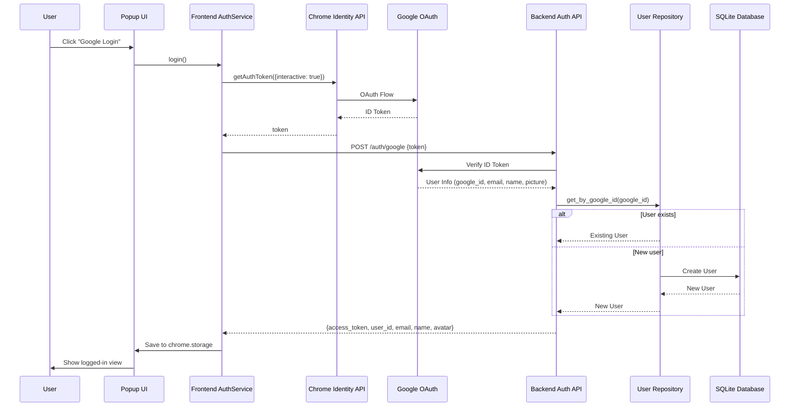

# Design Document: Google Login

## Overview

本设计文档描述 MixRead Chrome 扩展的 Google 登录功能实现。该功能允许用户通过 Google 账号进行身份验证，实现跨设备的词汇数据同步。

系统采用 OAuth 2.0 协议，通过 Chrome Identity API 获取 Google ID Token，然后将 Token 发送到后端进行验证和用户管理。

## Architecture



## Components and Interfaces

### 1. Frontend Components

#### 1.1 AuthService (frontend/chrome-extension/shared/auth-service.js)

已存在，需要完善错误处理。

```javascript
class AuthService {
  // 存储键
  tokenKey = "auth_token";
  userKey = "auth_user";

  // 主要方法
  async login(): Promise<SessionData>      // 发起登录流程 (Req 2.1, 2.2)
  async logout(): Promise<void>            // 登出并清除数据 (Req 3.3)
  async getUser(): Promise<UserData|null>  // 获取当前用户
  async getToken(): Promise<string|null>   // 获取 access token
  async isLoggedIn(): Promise<boolean>     // 检查登录状态 (Req 3.1, 3.2)
}

interface SessionData {
  access_token: string;
  user_id: string;
  email: string;
  name: string;
  avatar: string;
}
```

#### 1.2 Popup UI (frontend/chrome-extension/popup.js)

需要添加登录/登出按钮的事件处理。

```javascript
// 需要添加的功能
async function initializeAuthUI()           // 初始化认证 UI，检查现有会话 (Req 3.1)
async function handleLoginClick()           // 处理登录点击 (Req 2.1)
async function handleLogoutClick()          // 处理登出点击 (Req 3.3)
function updateAuthUI(isLoggedIn, userData) // 更新 UI 状态 (Req 2.5, 3.2, 3.4)
```

### 2. Backend Components

#### 2.1 Auth API (backend/api/auth.py)

已存在，接口定义完整。

```python
@router.post("/auth/google", response_model=AuthResponse)
async def google_login(auth_request: GoogleAuthRequest, db: Session)

class GoogleAuthRequest(BaseModel):
    token: str

class AuthResponse(BaseModel):
    access_token: str
    token_type: str
    user_id: str
    email: Optional[str]
    name: Optional[str]
    avatar: Optional[str]
```

#### 2.2 AuthService (backend/application/auth_service.py)

已存在，需要完善配置验证。

```python
class AuthService:
    GOOGLE_CLIENT_ID: str  # 从环境变量读取 (Req 1.2)
    SECRET_KEY: str        # JWT 签名密钥

    def verify_google_token(self, token: str) -> Dict  # (Req 2.3)
    def login_with_google(self, token: str) -> Dict    # (Req 2.4)
    def create_access_token(self, data: dict) -> str

    # 配置验证 (Req 1.3)
    def _validate_config(self) -> None  # 检查 GOOGLE_CLIENT_ID 是否配置
```

#### 2.3 UserRepository (backend/infrastructure/repositories.py)

已存在，支持 Google 用户管理。

```python
class UserRepository:
    def get_by_google_id(self, google_id: str) -> Optional[User]  # (Req 6.2)
    def update_google_info(self, user_id: str, google_id: str, email: str, avatar_url: str)  # (Req 6.1, 6.3)
```

### 3. Configuration

#### 3.1 Chrome Extension Manifest

```json
{
  "permissions": ["identity"],
  "oauth2": {
    "client_id": "YOUR_CLIENT_ID.apps.googleusercontent.com",
    "scopes": [
      "https://www.googleapis.com/auth/userinfo.email",
      "https://www.googleapis.com/auth/userinfo.profile",
      "openid"
    ]
  }
}
```

#### 3.2 Backend Environment Variables

```bash
GOOGLE_CLIENT_ID=your_client_id.apps.googleusercontent.com
SECRET_KEY=your_jwt_secret_key
```

## Data Models

### User Model (已存在)

```python
class UserModel(Base):
    __tablename__ = "users"

    user_id = Column(String(255), primary_key=True)
    created_at = Column(DateTime, default=datetime.now)
    updated_at = Column(DateTime, default=datetime.now, onupdate=datetime.now)

    # Google Auth Fields
    google_id = Column(String(255), unique=True, nullable=True, index=True)
    email = Column(String(255), unique=True, nullable=True, index=True)
    avatar_url = Column(String(500), nullable=True)

    # ... other fields
```

### Chrome Storage Schema

```javascript
// auth_token: JWT access token
chrome.storage.local.set({ auth_token: "eyJ..." });

// auth_user: User profile data
chrome.storage.local.set({
  auth_user: {
    user_id: "john_doe",
    email: "john@example.com",
    name: "John Doe",
    avatar: "https://...",
  },
});
```

## Correctness Properties

_A property is a characteristic or behavior that should hold true across all valid executions of a system—essentially, a formal statement about what the system should do. Properties serve as the bridge between human-readable specifications and machine-verifiable correctness guarantees._

### Property 1: User Creation/Retrieval Round-Trip

_For any_ valid Google user info (google_id, email, avatar_url), if the AuthService creates a user and then retrieves by the same google_id, the returned user should have the same google_id, email, and avatar_url.

**Validates: Requirements 2.4, 6.1, 6.2, 6.3**

### Property 2: Invalid Token Rejection

_For any_ invalid or malformed token string, the Auth_Service should return an HTTP 401 error with a descriptive message.

**Validates: Requirements 4.2, 4.4**

## Error Handling

### Requirements Traceability

| Requirement                     | Design Section                     | Implementation Notes           |
| ------------------------------- | ---------------------------------- | ------------------------------ |
| 1.1 OAuth client_id in manifest | Configuration 3.1                  | manifest.json oauth2.client_id |
| 1.2 GOOGLE_CLIENT_ID env var    | Configuration 3.2, AuthService 2.2 | 环境变量读取                   |
| 1.3 Missing config error        | AuthService.\_validate_config      | 返回清晰错误信息               |
| 1.4 OAuth scopes                | Configuration 3.1                  | email, profile, openid         |
| 2.1-2.6 Login flow              | Architecture diagram               | 完整流程覆盖                   |
| 3.1-3.4 Session management      | AuthService 1.1, Popup UI 1.2      | chrome.storage 持久化          |
| 4.1-4.4 Error handling          | Error Handling section             | 前后端错误处理表               |
| 5.1-5.4 Dev environment         | Development Environment Setup      | 开发配置文档                   |
| 6.1-6.4 User data association   | UserRepository 2.3, Data Models    | google_id 关联                 |

### Frontend Error Handling

| Error Scenario      | User Message               | Action                      |
| ------------------- | -------------------------- | --------------------------- |
| User cancels OAuth  | (no message)               | Return to login view        |
| Network error       | "Cannot connect to server" | Show retry button           |
| Backend returns 401 | "Login failed: [error]"    | Show error, return to login |
| Token storage fails | "Failed to save login"     | Log error, retry            |

### Backend Error Handling

| Error Scenario            | HTTP Status | Response                                       |
| ------------------------- | ----------- | ---------------------------------------------- |
| Invalid token format      | 401         | `{"detail": "Invalid token format"}`           |
| Token verification failed | 401         | `{"detail": "Invalid Google Token: [reason]"}` |
| Missing GOOGLE_CLIENT_ID  | 500         | `{"detail": "Server configuration error"}`     |
| Database error            | 500         | `{"detail": "Internal server error"}`          |

## Testing Strategy

### Unit Tests

1. **AuthService.verify_google_token** - 测试 token 验证逻辑
2. **UserRepository.get_by_google_id** - 测试用户查询
3. **UserRepository.update_google_info** - 测试用户信息更新

### Property-Based Tests

使用 Hypothesis (Python) 进行属性测试：

1. **Property 1**: 用户创建/检索往返测试

   - 生成随机的 google_id, email, avatar_url
   - 创建用户，然后通过 google_id 检索
   - 验证返回的用户数据一致

2. **Property 2**: 无效 Token 拒绝测试
   - 生成随机的无效 token 字符串
   - 验证 API 返回 401 错误

### Integration Tests

1. **完整登录流程** - 使用测试 token 验证端到端流程
2. **重复登录** - 验证同一用户多次登录返回相同 user_id

### Development Environment Setup (Requirement 5)

开发环境配置步骤：

1. **Google Cloud Console 配置**

   - 创建 OAuth 2.0 客户端 ID (类型: Chrome Extension)
   - 添加扩展 ID 到授权来源
   - 记录 Client ID 用于 manifest.json 和后端配置

2. **Chrome Extension 开发模式**

   - 在 `chrome://extensions` 启用开发者模式
   - 加载未打包的扩展 (frontend/ 目录)
   - 扩展支持连接 `http://localhost:8000`

3. **Backend 本地运行**
   - 设置环境变量: `GOOGLE_CLIENT_ID`, `SECRET_KEY`
   - 运行: `cd backend && python main.py`
   - 服务地址: `http://localhost:8000`

### Manual Testing Checklist

1. [ ] 在 GCP Console 创建 OAuth 2.0 客户端
2. [ ] 配置 manifest.json 中的 client_id
3. [ ] 设置后端环境变量
4. [ ] 加载扩展并测试登录按钮
5. [ ] 验证登录后 UI 显示用户信息
6. [ ] 验证登出功能
7. [ ] 验证刷新后保持登录状态
8. [ ] 验证用户取消 OAuth 流程时无错误显示 (Requirement 4.1)
9. [ ] 验证后端不可达时显示正确错误信息 (Requirement 4.3)
