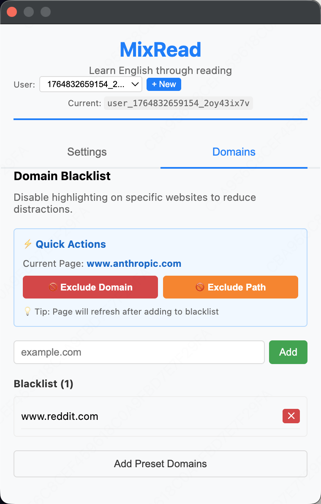
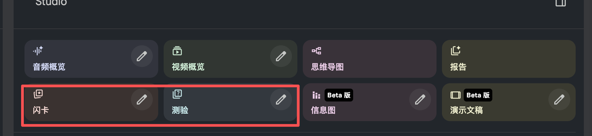

# Domain Blacklist Feature

## Overview

Domain Blacklist allows users to disable MixRead's word highlighting on specific websites.

## Current Implementation (P1) - ✅ Complete

### User Interface





### Key Features

1. **Default Blacklist** (13 pre-configured domains)

   - Development: localhost, 127.0.0.1
   - Learning Tools: quizlet.com, anki.deskew.com
   - Social Media: facebook.com, twitter.com, reddit.com, instagram.com, tiktok.com
   - Video Platforms: youtube.com
   - Privacy Sensitive: mail.google.com, github.com, stackoverflow.com

2. **Quick Actions**

   - One-click exclude current domain
   - One-click exclude current path
   - Auto-refresh after adding

3. **Management**

   - View all blacklisted domains
   - Remove domains (no confirmation needed)
   - Add custom domains
   - Restore preset domains

### User Guide

#### How to exclude a website:

1. Open the website you want to exclude
2. Click MixRead icon
3. Go to "Domains" tab
4. Click "Exclude Domain" button
5. Page refreshes - highlighting is disabled

#### How to restore a website:

1. Click MixRead icon
2. Go to "Domains" tab
3. Find domain in Blacklist list
4. Click "✕" button next to it

## Technical Implementation

### Backend

- **Repository**: `backend/infrastructure/repositories.py`

  - DEFAULT_BLACKLIST constant (13 domains)
  - `_import_default_blacklist()` for new users
  - UserRepository handles user-specific blacklists

- **Database Table**: `domain_management_policies`

  ```sql
  user_id, domain, policy_type, is_active, description, timestamps
  ```

- **API Endpoints**:

  ```
  GET    /users/{userId}/domain-policies/blacklist
  POST   /users/{userId}/domain-policies/blacklist
  DELETE /users/{userId}/domain-policies/blacklist/{domain}
  ```

### Frontend

- **UI**: `frontend/popup.html` (lines 170-214)

  - Quick Actions section
  - Blacklist display

- **Logic**: `frontend/popup.js` (lines 977-1163)

  - initializeQuickActions()
  - handleQuickExcludeDomain()
  - handleQuickExcludePath()
  - renderBlacklist()

- **Store**: `frontend/modules/domain-policy/domain-policy-store.js`

  - Data caching and API synchronization

## Testing

### Test Coverage (29 tests - 100% pass)

```bash
# Backend
python -m pytest backend/test_default_blacklist.py
python -m pytest backend/test_p1_integration.py

# Frontend
node frontend/test_p1_quick_actions.js
```

### Test Files

- `backend/test_default_blacklist.py` (7 tests)
- `backend/test_p1_integration.py` (7 tests)
- `frontend/test_p1_quick_actions.js` (15 tests)

## Future Enhancements (Not Yet Implemented)

- Context menu for quick exclude
- Multi-level matching (exact/subdomain/path)
- Admin platform for global presets

## Maintenance Notes

- Each user has independent blacklist stored in database
- Default domains are imported only for new users
- No confirmation dialog on delete (user preference)
- Port numbers are preserved in domain matching (e.g., localhost:8002)
