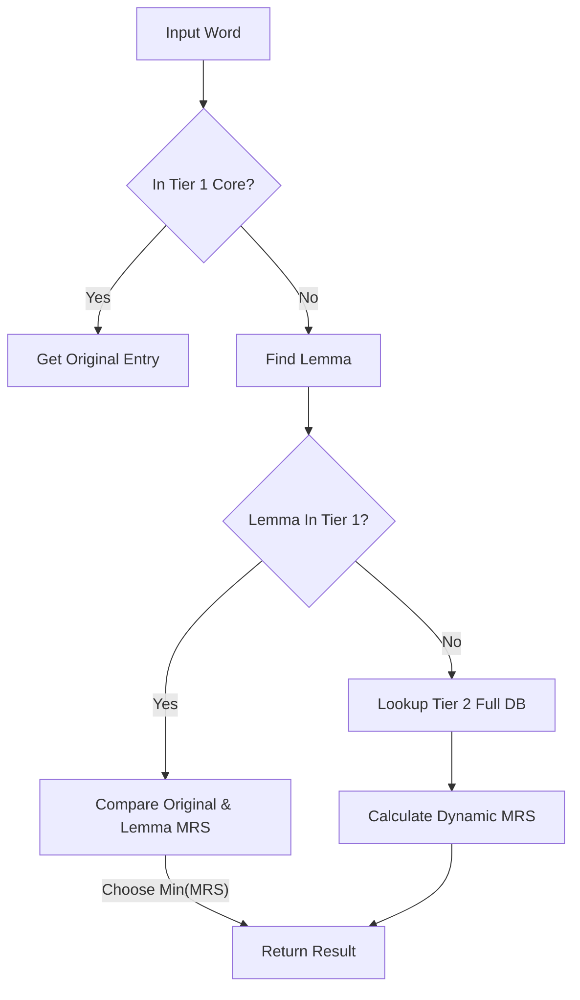

# Vocabulary Expansion & Difficulty System (词汇扩展与难度系统)

**Status**: Phase 2 (In Progress - Implementation Refined)
**Last Updated**: 2025-12-21

---

## 1. Core Philosophy (核心理念)

为了实现"更加流畅阅读，尽可能避免查词"的目标，我们的系统设计遵循以下原则：

1.  **覆盖核心高频词**：静态内置 Top 30,000 高频词，覆盖 98%+ 的日常阅读需求，保证极速响应。
2.  **长尾词汇混合处理 (Hybrid)**：对于 Top 30,000 以外的低频词（长尾词），采用"本地缓存 + 实时查询"的混合模式。**决不因为词库未收录而不展示释义**，确保用户无障碍阅读。
3.  **统一难度量表 (Unified Level)**：打破 CEFR/托福/雅思的壁垒，建立统一的 **0-100+ 难度分值 (MRS)**。用户既可以选 "B1"，也可以选 "托福 80 分"，系统自动转换为内部统一分值进行处理。

---

## 2. Vocabulary Data Structure (词汇数据结构)

我们构建一个分层的词汇系统：

### Tier 1: Core Static Library (核心静态库) - Top 30,000

- **来源**: ECDICT (基于 BNC/COCA 词频筛选 Top 30,000)
- **存储**: `cefr_words.json` (加载至内存)
- **内容**: 包含完整释义、词频、CEFR 等级、MRS 分数。
- **作用**: 毫秒级响应，支持主要阅读体验。覆盖 98%+ 阅读需求。

### Tier 2: Dynamic Extended Library (动态扩展库) - Infinite (770k+)

- **来源**: 完整 ECDICT 数据库 (SQLite)
- **存储**: `mixread.db` (SQLite)
- **机制**:
  - 当用户请求 Top 30,000 以外的词时，先查 Tier 1。
  - 若未命中，通过 `DictionaryService` 直接查询 SQLite 全量库。
  - **动态评分**: 对于 Tier 2 中的词，基于其 `ranking` 字段实时计算 MRS。
- **作用**: 覆盖专业词汇、生僻词，确保"所有词皆可查"。

---

## 3. Unified Difficulty System (统一难度系统)

引入 **MixRead Level (MRS - MixRead Score)**，范围 0-150。

### 3.1 难度映射与计算 (MRS Mapping)

MRS 基于词频排名 (`rank`) 进行对数线性映射：

| MRS Score     | CEFR   | 词频排名 (Rank) | 描述                     |
| :------------ | :----- | :-------------- | :----------------------- |
| **0 - 20**    | **A1** | Top 1,000       | 极基础词汇 (the, is, go) |
| **20 - 40**   | **A2** | 1,000 - 3,000   | 基础日常交流             |
| **40 - 60**   | **B1** | 3,000 - 6,000   | 能读懂大意 (CET-4)       |
| **60 - 80**   | **B2** | 6,000 - 10,000  | 进阶阅读 (IELTS 6.0)     |
| **80 - 100**  | **C1** | 10,000 - 15,000 | 专业学术 (TOEFL 100)     |
| **100 - 150** | **C2** | 15,000+         | 极生僻/专业领域          |

**计算逻辑**:

- `Rank <= 1,000`: `log10(rank)` 线性映射至 0-20。
- `1,000 < Rank <= 15,000`: `log10(rank)` 线性映射至 20-100。
- `Rank > 15,000`: 映射至 100-150。

### 3.2 单词高亮逻辑 (Highlight Logic)

- **Diff = Word_MRS - User_MRS**
- `Diff > 0`: 高亮为生词。
- `Diff <= 0`: 视为已知，不高亮。

---

## 4. Lemmatization Strategy (词形还原策略)

针对英语中丰富的词形变化（复数、时态、比较级等），系统采用以下策略确保识别准确性：

### 4.1 混合还原引擎 (Hybrid Engine)

系统按优先级尝试以下还原方式：

1.  **静态字典映射 (Priority High)**: 使用 ECDICT 的 `lemma.en.txt`。这是一个基于数百万语料库预生成的变体对应表，准确率极高。
2.  **动态规则分析 (Priority Medium)**: 使用 `lemminflect` 库。当静态表未命中时，基于语法规则（VERB/NOUN/ADJ）动态推导原型。

### 4.2 最低难度优先原则 (Min-MRS Rule)

这是解决"简单词变体被误判为难词"的关键逻辑。

- **逻辑**: 对于输入的 `word`，系统会同时获取其 `original_word` 和 `lemma`（原型）。如果两者都在词库中，系统将选择 **MRS 分数较低** 的那一个。
- **场景**: 单词 `uses`。
  - 直接查 `uses` 可能在 Tier 1 中查不到，回退到 Tier 2 计算出一个很高的 MRS。
  - 还原为 `use` 后，查得其 MRS 为 5。
  - 系统最终采用 `use` 的数据，避免了因为复数形式而将一个基础词标记为生词。

### 4.3 检索流水线 (Lookup Pipeline)

---

## 5. Implementation Progress

### Done (已完成)

- [x] **ECDICT 数据整合**: 成功集成 77 万词库 SQLite。
- [x] **MRS 计算引擎**: 实现基于对数分布的词频难度转换。
- [x] **Tiered Lookup**: 建立 Tier 1 (Memory) + Tier 2 (SQLite) 检索链。
- [x] **混合词形还原**: 集成 `lemma.en.txt` 与 `lemminflect`，实现 Min-MRS 决策逻辑。

### Upcoming (后续)

- [ ] **用户词库同步**: 将用户在 Extension 中标记的 "Known" 单词持久化，并影响高亮逻辑。
- [ ] **释义个性化**: 优先展示与当前语境相匹配的释义（基于词性标注）。
