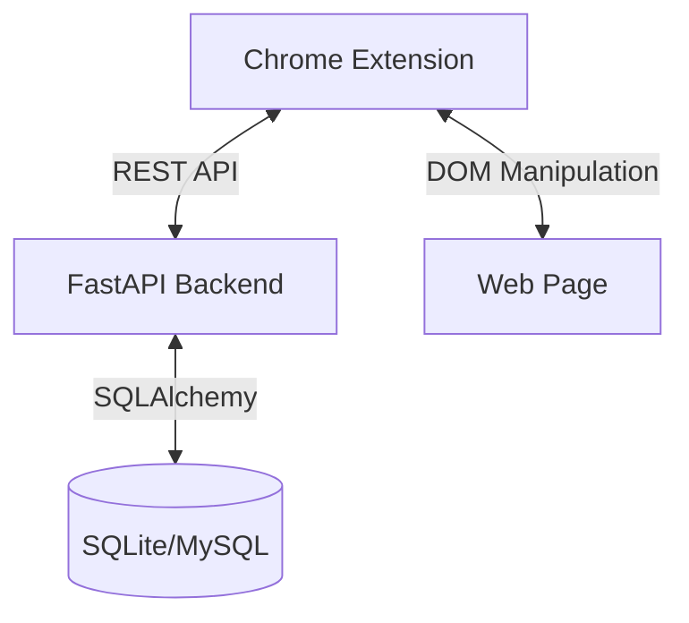

# System Architecture

**Last Updated**: 2025-12-03

---

## 🏗️ High-Level Overview

MixRead consists of a **Chrome Extension (Frontend)** and a **FastAPI Server (Backend)**.

---

## 🧠 Key Architectural Decisions

### 1. Domain Management Storage

**Decision**: **Self-hosted Database (DomainManagementPolicy)**

- **Why**: To support future extensibility (Whitelists, Mixed Mode) and maintain data sovereignty.
- **Implementation**:
  - Backend: `DomainManagementPolicy` table with `policy_type` enum.
  - Frontend: `DomainPolicyStore` syncs with backend API.
- **Status**: ✅ Implemented (Phase 1 Blacklist).

### 2. Word Data Source

**Decision**: **Hybrid (Local Core + API Cache)**

- **Core**: CEFR-J dataset (~7,000 words) stored locally in backend.
- **Expansion**: Dynamic fetching from external Dictionary APIs (planned).
- **Core**: CEFR-J dataset (~7,000 words) stored locally in backend.
- **Learning Pool**: User-added words with context (contexts_json) stored in `vocabulary_entries`.
- **Expansion**: Dynamic fetching from external Dictionary APIs (planned).

### 3. Frontend Architecture

**Decision**: **Modular Vanilla JS**

- **Why**: Avoid build step complexity for MVP; lightweight.
- **Structure**:
  - `modules/`: Feature-specific logic (User, Highlight, DomainPolicy).
  - `scripts/`: Shared utilities (Logger, API Client).
  - `content.js`: Main entry point and orchestration.

### 4. Error Handling

**Decision**: **3-Layer Wrapper Pattern**

- **Why**: Chrome Extension context invalidation causes uncaught errors.
- **Implementation**: `ChromeAPI` wrapper handles:
  1.  Context validation (`isContextValid`).
  2.  Try-catch around API calls.
  3.  Try-catch inside async callbacks.

---

## 💾 Database Schema

### Users

- `user_id`: String (Primary Key)
- `known_words_json`: JSON (Set of known words)

### Domain Policies

- `user_id`: FK
- `policy_type`: Enum (blacklist/whitelist)
- `domain`: String
- `is_active`: Boolean

### Vocabulary (Unified Learning System)

- `user_id`: FK
- `word`: String
- `status`: Enum (learning/reviewing/mastered)
- `contexts_json`: JSON (List of encountering contexts: sentence, url, page_title)
- `srs_state`: (last_review, next_review, interval, easiness) - SM2 fields

---

## 🔄 Data Flow

1.  **Initialization**:
    - Extension loads → Checks `DomainPolicy` (Backend) → Decides to highlight.
2.  **Highlighting**:
    - Extract text → Send to Backend (`/highlight-words`) → Receive matches.
3.  **Interaction**:
    - User clicks word → Backend fetches definition (`/word/{word}`).
    - User marks known → Backend updates `known_words`.
